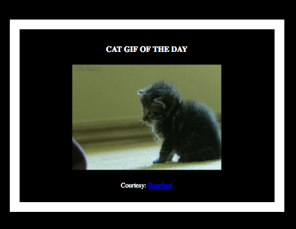

# Java Servlet Tutorial

This tutorial covers how to develop a Java servlet using Docker with your preferred IDE

## Building and running the application

This example requires Docker CE 17.06 or higher. Clone the repository, build the application and deploy it in Tomcat:

```
docker image build -t catweb_java .
```

The Dockerfile uses a multi-stage build to compile the servlet and package it into a war file.

```
# build servlet and create war file
FROM maven:latest AS warfile
WORKDIR /usr/src/catweb
COPY pom.xml .
RUN mvn -B -f pom.xml -s /usr/share/maven/ref/settings-docker.xml dependency:resolve
COPY . .
RUN mvn -B -s /usr/share/maven/ref/settings-docker.xml package
```
The pom.xml file is copied to a maven container and dependencies are added to the maven container. The code is copied to the maven container and the servlet war file is generated.
```
FROM tomcat:9.0-jre8-alpine
# ADD tomcat/catalina.sh $CATALINA_HOME/bin/
WORKDIR /usr/local/tomcat/bin
COPY run.sh run.sh
RUN chmod +x run.sh
#Copy war file
WORKDIR /usr/local/tomcat/webapps
COPY  --from=warfile /usr/src/catweb/target/java-servlet-example-0.0.1-SNAPSHOT.war CatWeb.war
# Expose ports
ENV JPDA_ADDRESS="8000"
ENV JPDA_TRANSPORT="dt_socket"
EXPOSE 8080
WORKDIR /usr/local/tomcat/bin
CMD ["run.sh"]
```
In the second part of the build, the war file is copied from the maven container to a Tomcat image and ports are exposed for the servlet engine and debugging.

The advantage of a multi-stage build is that tools for compiling and packaging the application are in the maven container and only the war file is copied to the Tomcat image. This results in a leaner and more efficient image.

To run the image:

````
docker container run -d --name catweb -p 8080:8080 -p 8000:8000 catweb_java
```` 
## The CatWeb Application

The catpic servlet responds to a request by randomly selecting a link from an array URLS. The image is read into a buffered image and written to the servlet's response stream.

The image is rendered in an HTML page. Reloading the page calls the catpic servlet and loads a new cat picture in the frame.


## Deployment Details

The application consists of a servlet that renders images from a list of URLs in a web page and the default Tomcat servlet. It is configured via the web.xml file making use of the default servlet to serve the index.html page.

```
  <servlet>
    <servlet-name>default</servlet-name>
    <servlet-class>org.apache.catalina.servlets.DefaultServlet</servlet-class>
  </servlet>

  <servlet-mapping>
    <servlet-name>default</servlet-name>
    <url-pattern>*.html</url-pattern>
  </servlet-mapping>
  
  <servlet-mapping>
    <servlet-name>default</servlet-name>
    <url-pattern>*.css</url-pattern>
  </servlet-mapping>
```
The catpic servlet that renders images from URLS is configured as a separate servlet.
```
 <servlet>
    <servlet-name>catpic</servlet-name>
    <servlet-class>com.docker.catpic</servlet-class>
 </servlet>

  <servlet-mapping>
    <servlet-name>catpic</servlet-name>
    <url-pattern>/</url-pattern>
  </servlet-mapping> 
```
## Debugging in an Eclipse
